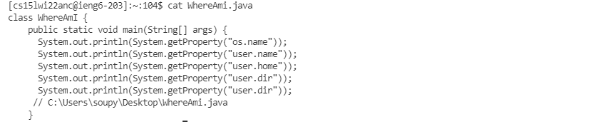
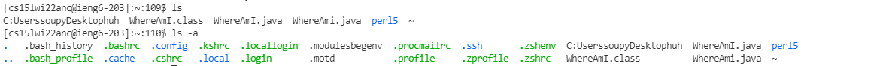
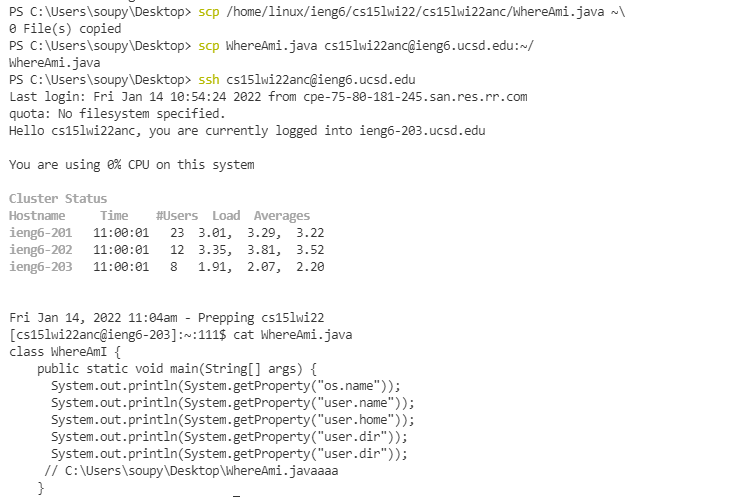
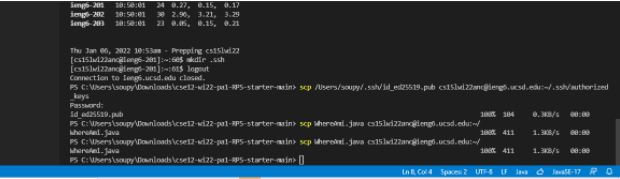
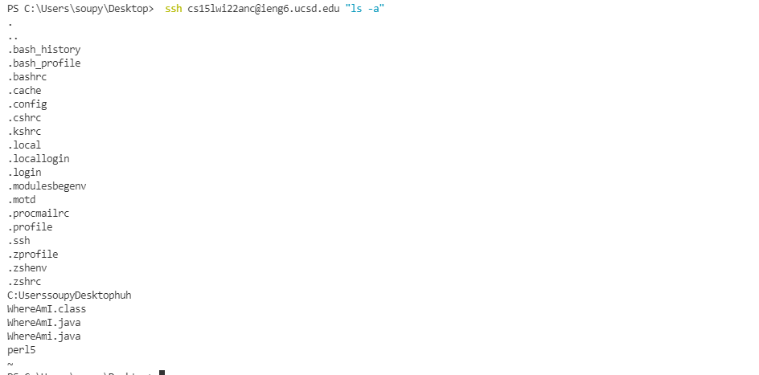

# Installing Visual Studio Code
1. Go to [https://code.visualstudio.com/](https://code.visualstudio.com/) and install visual studio code. The website should look like this.
2. Click the blue button in the middle of the screen to download for Windows. If you have a mac or something that isn't windows, click the dropdown next to the download button for more download options. 


# Remotely Connecting
1. Before remotely connecting, you need to install OpenSSH. Go to [https://docs.microsoft.com/en-us/windows-server/administration/openssh/openssh_install_firstuse](https://docs.microsoft.com/en-us/windows-server/administration/openssh/openssh_install_firstuse) and follow the instructions on the website to set up OpenSSH.
2. You will also need to set up your cs15l account here [https://sdacs.ucsd.edu/~icc/index.php](https://sdacs.ucsd.edu/~icc/index.php).
3. If everything is set up correctly, open a terminal in vscode and type  
 ```ssh cs15lwi22anc@ieng6.ucsd.edu```  
 with the anc being replaced by the letters for your account. Enter your password. 

# Trying Some Commands
1. On the remote server, try the cat command. This lets you see the contents of a file.    
``` cat WhereAmI.java```

2. Try the ls command. This lets you see files and folders in directory. Putting a ~ after ls lets you see folders that start with a "."   
``` ls ```  
```ls -a```


# Moving Files with scp
To move files from your computer to the remote computer, type scp, the file you want to send, then the account and place you want to send it to. You should be prompted to enter your password. You can then check the files by using the cat command on the remote computer.  
``` scp WhereAmi.java cs15lwi22anc@ieng6.ucsd.edu:~/```
first command should not be there

# Setting an SSH key
You can get rid of the need to enter your password by setting an SSH key. To create a public key and private key, type ssh-keygen -t ed25519. Then, press enter twice to accept default locations and empty passwords. Then, follow instructions on [https://docs.microsoft.com/en-us/windows-server/administration/openssh/openssh_keymanagement#user-key-generation](https://docs.microsoft.com/en-us/windows-server/administration/openssh/openssh_keymanagement#user-key-generation).
Then, type in commands shown in picture to move public key to remote server after logging onto the remote server.  
```ssh-keygen -t ed25519   ```  
``` mkdir .ssh```  
```scp /Users/soupy/.ssh/id_ed25519.pub cs15lwi22anc@ieng6.ucsd.edu:~/.ssh/authorized_keys     ```

The picture is in dark mode because this is from when I was doing it in lab

# Optimizing Remote Running
To make running commands easier on remote server, you can use ssh keys to not need to type your password everytime you try to log in.
You can also put certain commands in quotes after ssh to run them on the server without having to log on.  
``` ssh cs15lwi22anc@ieng6.ucsd.edu "ls" ``` This has 37 keystrokes.
Running ```ssh cs15lwi22anc@ieng6.ucsd.edu``` then running ```ls``` then logging out with ```logout``` has a combined total of 42 keystrokes



