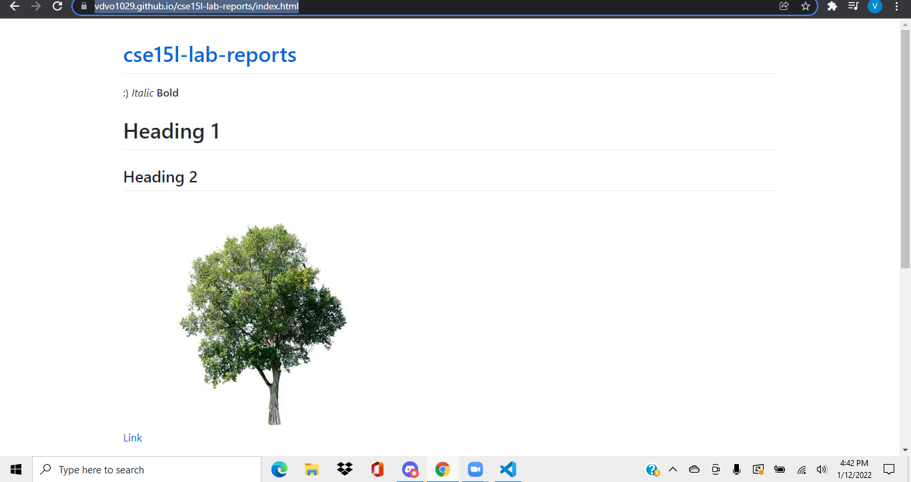
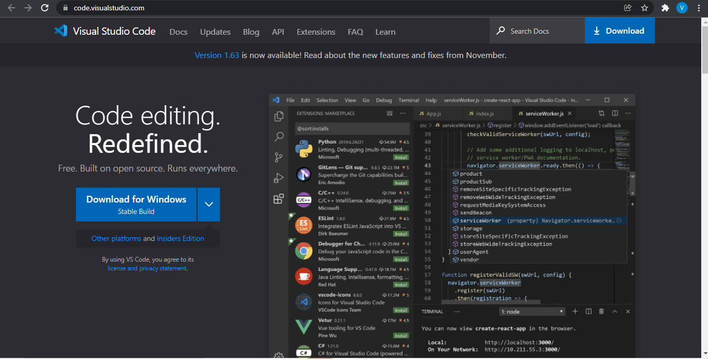
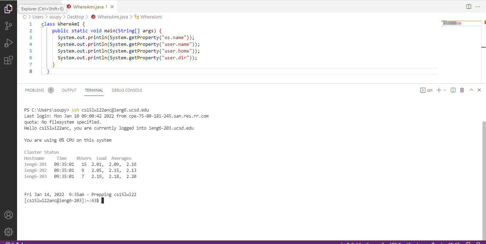

# Installing Visual Studio Code
1. Go to https://code.visualstudio.com/ and install visual studio code. The website should look like this.
2. Click the blue button in the middle of the screen to download for Windows. If you have a mac or something that isn't windows, click the dropdown next to the download button for more download options. 

# Remotely Connecting
1. Before remotely connecting, you need to install OpenSSH. Go to [https://docs.microsoft.com/en-us/windows-server/administration/openssh/openssh_install_firstuse](https://docs.microsoft.com/en-us/windows-server/administration/openssh/openssh_install_firstuse) and follow the instructions on the website to set up OpenSSH.
2. You will also need to set up your cs15l account here [https://sdacs.ucsd.edu/~icc/index.php](https://sdacs.ucsd.edu/~icc/index.php).
3. If everything is set up correctly, open a terminal in vscode and type "ssh cs15lwi22anc@ieng6.ucsd.edu" with the anc being replaced by the letters for your account. Enter your password. 

# Trying Some Commands

