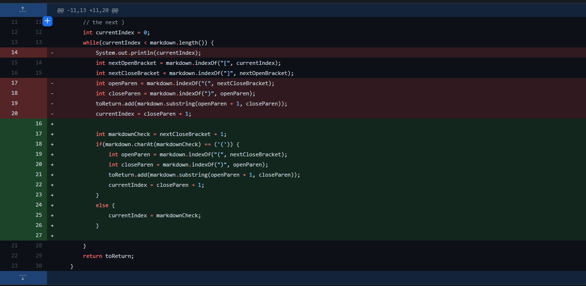
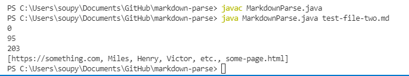
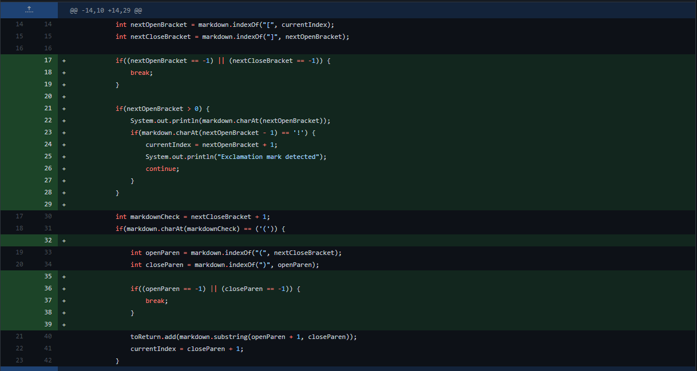
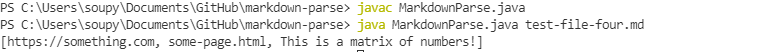
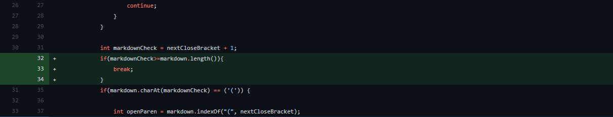
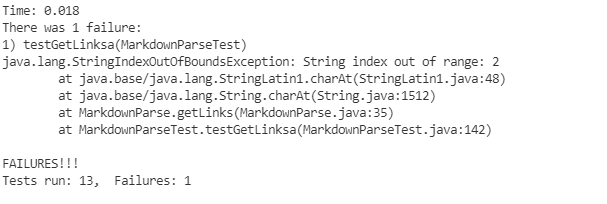

# Code Change 1

[This test](https://github.com/msimitz/markdown-parse/blob/main/test-file-two.md) is the test that had an unexpected output   
   
This is the symptom of the bug

 The failure inducing input had space between the brackets and parentheses on line 4. Space between brackets and parentheses is not recognized as a link by markdown but the code still recorded the "link" because it does not take the space into account.

 # Code Change 2

 
 [This test](https://github.com/msimitz/markdown-parse/blob/c7d765f83ecdcd05fa099515d66eccbade8e3760/test-file-four.md) is another test that had an unexpected output.  

 This is the symptom of the bug
 

 The failure inducing input had an exclamation mark before the brackets on line 6 which indicates an image and not a link. However, the code recognizes what should be an image as a link. The code does not the character before the first bracket into account which is why it thinks the image is a link. 

 # Code Change 3
 
 [This](https://github.com/vdvo1029/markdown-parse/blob/main/test-file1.md) is the link to the failure inducing input

 This is the symptom of the bug
 

 The failure inducing input was just a set of brackets and no parentheses which threw an exception. This happened because the input string had a length of 2 but ```if(markdown.charAt(markdownCheck) == ('('))``` looked for a character at an index that was out of bounds. Markdowncheck is the index of the character after the closed bracket.
 ```int markdownCheck = nextCloseBracket + 1;```
 
