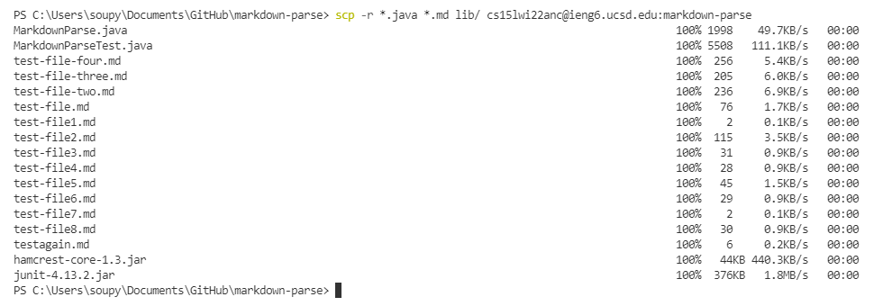
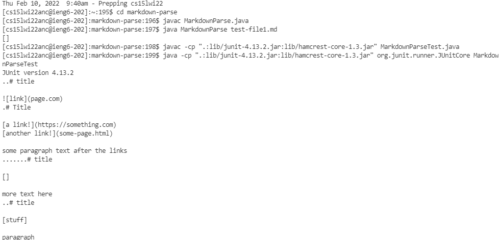
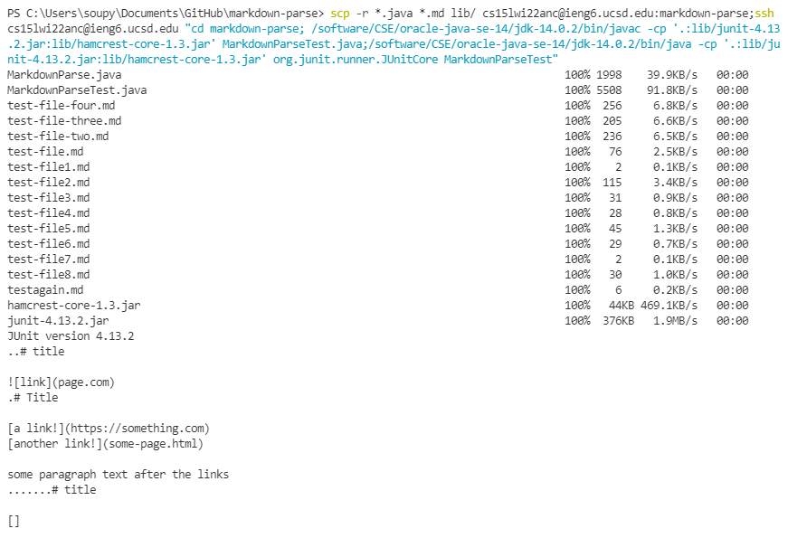

# Copying Whole Repositories with ```scp -r```

Copying the markdownparse repository was done using ```scp -r *.java *.md lib/ cs15lwi22anc@ieng6.ucsd.edu:markdown-parse```. The ```*.java``` and the ```*.md``` makes the command copy only the files with ```.java``` and ```.md```.


Since I copied the repository into a folder, I had to ```cd``` into the folder and run the test from there. The tests still ran as normal. 



I used semi colons to separate the commands on one line and quotes for commands to run on ieng6. There was a problem involving different java versions when I tried using ```scp -r *.java *.md lib/ cs15lwi22anc@ieng6.ucsd.edu:markdown-parse;ssh 
cs15lwi22anc@ieng6.ucsd.edu "javac -cp '.:lib/junit-4.13.2.jar:lib/hamcrest-core-1.3.jar' MarkdownParseTest.java;java -cp 
'.:lib/junit-4.13.2.jar:lib/hamcrest-core-1.3.jar' org.junit.runner.JUnitCore MarkdownParseTest"
```  but I looked at one of the posts on piazza and replaced the ```javac``` and ```java``` with ```/software/CSE/oracle-java-se-14/jdk-14.0.2/bin/javac``` and ```/software/CSE/oracle-java-se-14/jdk-14.0.2/bin/java```. The whole thing ended up looking like ```scp -r *.java *.md lib/ cs15lwi22anc@ieng6.ucsd.edu:markdown-parse;ssh 
cs15lwi22anc@ieng6.ucsd.edu "cd markdown-parse; /software/CSE/oracle-java-se-14/jdk-14.0.2/bin/javac -cp '.:lib/junit-4.13.2.jar:lib/hamcrest-core-1.3.jar' MarkdownParseTest.java;/software/CSE/oracle-java-se-14/jdk-14.0.2/bin/java -cp '.:lib/junit-4.13.2.jar:lib/hamcrest-core-1.3.jar' org.junit.runner.JUnitCore MarkdownParseTest"```