# Lab Report 8
[My repository](https://github.com/vdvo1029/markdown-parse)  
[Other group's repository](https://github.com/CatFish47/markdown-parse)
## Snippet 1
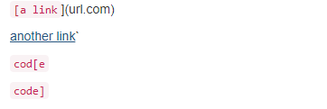  
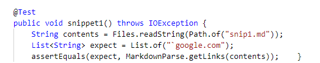  
This test was used for both implementations.  
The CommonMark demo site says that snippet 1 should includes the `` `google.com `` link.  
My implmentation didn't pass the test.
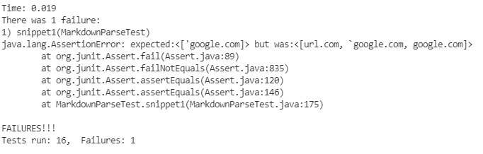  
The other group's implementation didn't pass either.
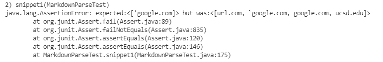

## Snippet 2
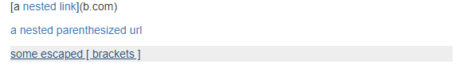
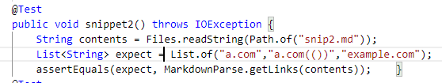  
This test was used for both implementations.  
The CommonMark demo site says that there should be 3 links. The links should be `a.com`, `a.com(())`, and `example.com`  
My implementation didn't pass the test.  
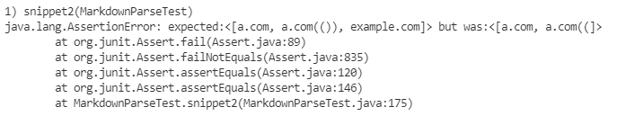  
The other group's implementation didn't pass the test either.
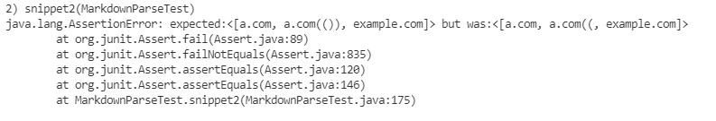  

## Snippet 3
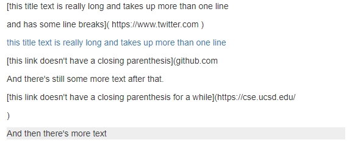 
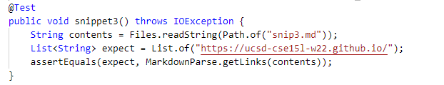  
This test was used for both implementations.  
The CommonMark demo site says that there should be 1 link. The link should be `https://ucsd-cse15l-w22.github.io/`  
My implementation didn't pass the test.
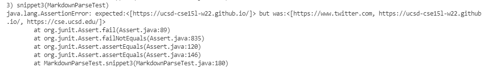  
The other group's implementation didn't pass the test either.
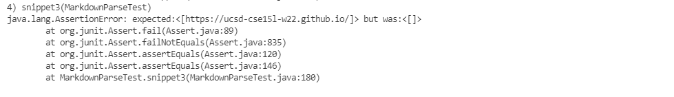

# Questions
1. Yes. Having a check for backticks inside of the brackets and getting rid of links with backticks could work. This can be done by grabbing the string inside of the brackets of a link and using `indexOf` to check for a backtick.
2. I think that a bigger change is needed to fix this bug. I think that nested links, nested parentheses, and nested brackets are all different problems that each require small changes to fix. I think 3 small changes are needed to fix this.
3. Yes. I think that links with more than 1 newline between the brackets or the parentheses don't count. Having a check for multiple new lines could work. This can be done with a loop with less than 10 lines. 

