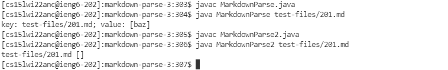
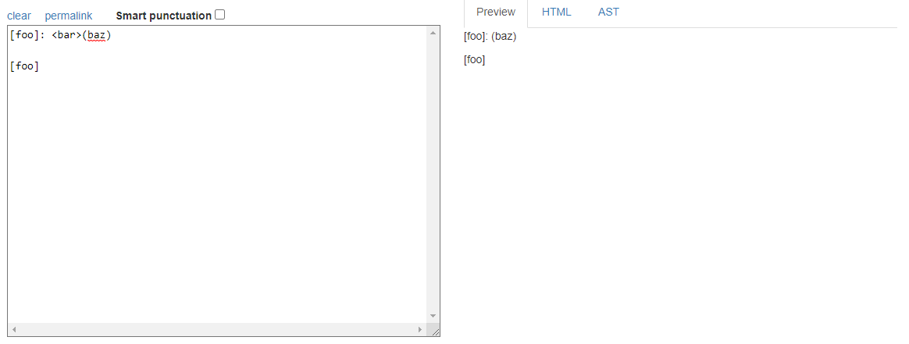
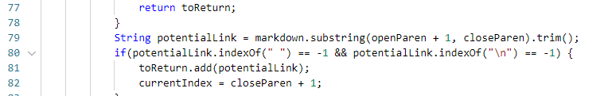
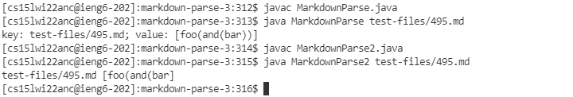
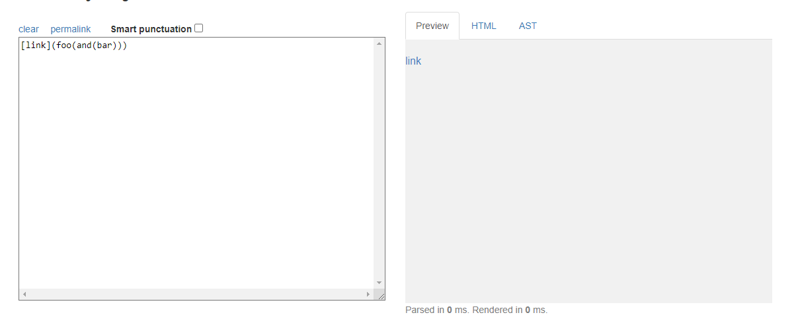
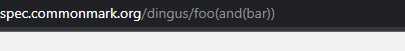
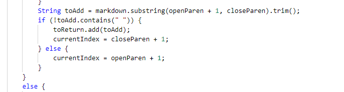

# Lab Report 5

To find tests with different results I added code to filter out test files that didn't have any brackets or parentheses since files without them wouldn't have any links. Then, I used the bash file Joe gave us to put the files with links and their results in a text file. I did this for both implementations then manually compared the two text files to find files with different results.   
 
## Test 1   test-files/201.md
These are the outputs of running MarkdownParse on both implementation.    
This was used for Joe's implemenation 
```
 javac MarkdownParse.java
 java MarkdownParse test-files/201.md
```
 This was used for my implemenation
```
 javac MarkdownParse.java
 java MarkdownParse2 test-files/201.md
```
These are the results of running those commands


The Commonmark demo site says that my implementation is correct for this test.


This part of Joe's code needs to be fixed. 
   
It will not count a link with space bars inside of it as a link. However, it does not consider the characters between the closing bracket and open parentheses. For example, Joe's implementation would count ```[a]3(a.com)``` even if there's a 3 between the close bracket and open parentheses.  

## Test 2 test-file/495.md
These are the outputs of running MarkdownParse on both implementation.    
This was used for Joe's implemenation 
```
 javac MarkdownParse.java
 java MarkdownParse test-files/495.md
```
 This was used for my implemenation
```
 javac MarkdownParse.java
 java MarkdownParse2 test-files/495.md
```
These are the results of running those commands

Both implementations say that the file has one link but my implementation has the wrong link. It is missing two closing parentheses.
  

This is the part of my implementation that needs to be fixed.   

The problem with the program is that it doesn't consider the fact that links can have sets of parentheses as long as they are complete sets. When checking the contents of the link, the program only checks for  spacebars before adding the link. 